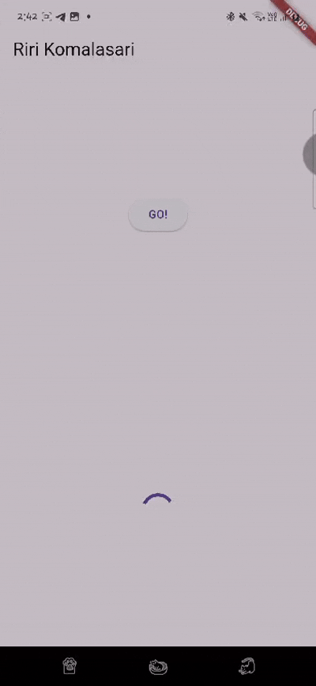

praktikum 1 hasil soal 2

praktikum 1 soal 3

Kode pada langkah 5 menggunakan substring untuk mengambil sebagian teks dari hasil API agar tampilan UI lebih rapi dan tidak terlalu panjang. Selain itu, catchError digunakan untuk menangani kesalahan yang mungkin terjadi saat mengambil data, seperti masalah jaringan atau respons API yang tidak valid, sehingga aplikasi tetap berjalan tanpa crash.

praktikum 2 soal 4

Kode pada langkah 1 dan 2 dalam praktikum 2 bertujuan untuk menjalankan tiga fungsi asynchronous (returnOneAsync, returnTwoAsync, returnThreeAsync) yang masing-masing memiliki delay 3 detik sebelum mengembalikan nilai. Method count() kemudian menjumlahkan hasil dari ketiga fungsi tersebut, sehingga totalnya adalah 6 setelah semua proses selesai dalam waktu 9 detik. Pola async/await digunakan untuk memastikan bahwa setiap fungsi menunggu hingga selesai sebelum melanjutkan ke proses berikutnya, membuat kode lebih bersih dan mudah dibaca dibandingkan menggunakan callback atau then().

praktikum 3 soal 5

Kode pada langkah 2 dalam praktikum 3 menggunakan Completer untuk mengontrol kapan sebuah Future akan selesai. Variabel completer dideklarasikan sebagai Completer<int>, lalu metode getNumber() menginisialisasi completer dan memanggil calculate(), yang setelah delay 5 detik akan menyelesaikan Future dengan nilai 42 menggunakan completer.complete(42). Pendekatan ini memungkinkan kita untuk menyelesaikan Future secara manual kapan saja, memberikan fleksibilitas lebih dalam mengelola operasi asynchronous dibandingkan hanya menggunakan Future.delayed.

praktikum 3 soal 6

Perbedaan kode langkah 2 dengan langkah 5-6 dalam praktikum 3 terletak pada cara menangani hasil Future. Pada langkah 2, Completer digunakan untuk menyelesaikan Future secara manual dengan completer.complete(42). Sementara pada langkah 5-6, getNumber() dipanggil menggunakan then(), yang langsung menetapkan hasilnya ke setState(), memperbarui UI saat Future selesai. Selain itu, catchError() ditambahkan untuk menangani kemungkinan error, sehingga jika terjadi kesalahan, UI akan menampilkan pesan error.

praktikum 4 soal 7 & 8

Perbedaan kode langkah 1 dan 4 dalam praktikum 4 terletak pada cara menjalankan beberapa Future secara paralel. Pada langkah 1, FutureGroup digunakan untuk mengelola beberapa operasi asynchronous secara bersamaan, di mana kita harus menambahkan Future satu per satu ke dalam grup sebelum menunggu hasilnya. Sedangkan pada langkah 4, Future.wait([]) langsung menjalankan semua Future dalam sebuah list dan menunggu hingga semuanya selesai sekaligus. Future.wait([]) lebih sederhana dan langsung mengembalikan hasil dalam bentuk list tanpa perlu mengelola grup secara manual, membuat kode lebih ringkas dan mudah dipahami.

praktikum 5 soal 9 & 10

Ketika kode ini dijalankan, aplikasi Flutter akan menampilkan layar dengan tombol GO, teks kosong di awal, dan sebuah CircularProgressIndicator. Saat tombol ditekan, fungsi handleError() akan dipanggil, yang pada gilirannya menjalankan returnError(). Fungsi ini menunggu 2 detik sebelum melempar Exception dengan pesan Something terrible happened!. Kesalahan ini ditangkap dalam blok try-catch, dan pesan error ditampilkan di layar dengan setState(), menggantikan teks kosong sebelumnya. Di konsol debug, teks Complete juga akan dicetak dari blok finally. CircularProgressIndicator tetap ada di layar karena tidak dikontrol oleh perubahan state dalam kode ini

praktikum 6 soal 12

koordinat GPS muncul di browser saat dijalankan menggunakan run debug karena browser dapat mengakses layanan lokasi dengan izin yang sesuai. Namun, ketika dijalankan dengan flutter run di terminal, koordinat tidak muncul karena emulator atau perangkat mungkin tidak memberikan izin lokasi secara default, atau layanan lokasi tidak diaktifkan dengan benar. Selain itu, saat debug, aplikasi bisa menggunakan layanan lokasi simulasi atau cache yang membuat koordinat tetap muncul. 

praktikum 7 soal 13 

Ya ada perbedaan UI antara praktikum ini dengan sebelumnya karena di praktikum ini menggunakan FutureBuilder. Dengan FutureBuilder, UI akan diperbarui secara otomatis berdasarkan status dari Future yang sedang berjalan. Hal ini berbeda dengan praktikum sebelumnya, di mana harus secara manual memanggil setState() untuk memperbarui UI setelah mendapatkan data. FutureBuilder membuat kode lebih rapi, efisien, dan reaktif terhadap perubahan data yang diperoleh dari proses asynchronous.

praktikum 7 soal 14

Ya, ada perbedaan UI setelah menambahkan handling error pada langkah ini. Sebelumnya, jika terjadi error mungkin aplikasi hanya akan menampilkan layar kosong atau berhenti tanpa memberi tahu pengguna. Setelah menambahkan pengecekan snapshot.hasError, UI sekarang bisa menampilkan pesan kesalahan seperti Something terrible happened! jika ada masalah. Ini membuat aplikasi lebih informatif dan mudah dipahami oleh pengguna saat terjadi error.

praktikum 8 soal 16

Ketika mengklik setiap tombol, warna latar belakang aplikasi berubah sesuai dengan warna yang telah dipilih pada halaman kedua. Hal ini terjadi karena fungsi _navigateAndGetColor() menggunakan await Navigator.push(), yang menunggu hingga halaman kedua dikembalikan sebelum memperbarui warna latar belakang. Dengan cara ini, nilai warna yang dipilih oleh pengguna dikembalikan ke halaman pertama dan diterapkan menggunakan setState(), sehingga UI berubah secara dinamis.

