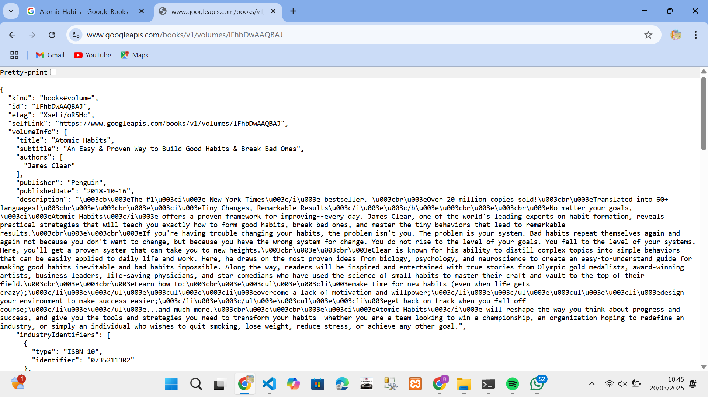
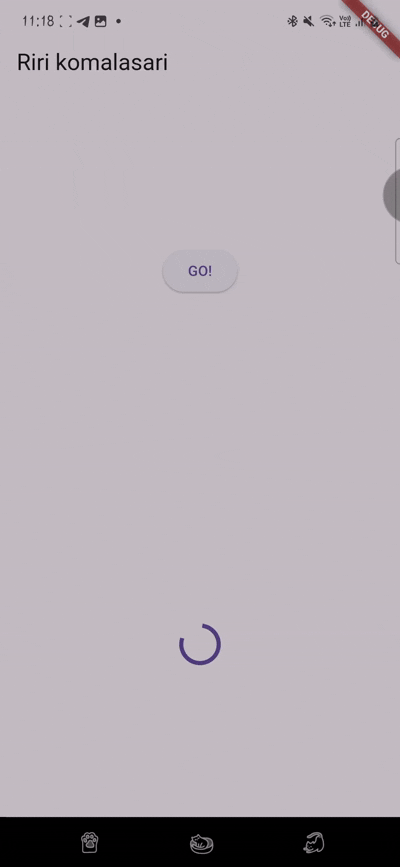

praktikum 1 hasil soal 2

praktikum 1 soal 3

Kode pada langkah 5 menggunakan substring untuk mengambil sebagian teks dari hasil API agar tampilan UI lebih rapi dan tidak terlalu panjang. Selain itu, catchError digunakan untuk menangani kesalahan yang mungkin terjadi saat mengambil data, seperti masalah jaringan atau respons API yang tidak valid, sehingga aplikasi tetap berjalan tanpa crash.

praktikum 2 soal 4

Kode pada langkah 1 dan 2 dalam praktikum 2 bertujuan untuk menjalankan tiga fungsi asynchronous (returnOneAsync, returnTwoAsync, returnThreeAsync) yang masing-masing memiliki delay 3 detik sebelum mengembalikan nilai. Method count() kemudian menjumlahkan hasil dari ketiga fungsi tersebut, sehingga totalnya adalah 6 setelah semua proses selesai dalam waktu 9 detik. Pola async/await digunakan untuk memastikan bahwa setiap fungsi menunggu hingga selesai sebelum melanjutkan ke proses berikutnya, membuat kode lebih bersih dan mudah dibaca dibandingkan menggunakan callback atau then().

praktikum 3 soal 5

Kode pada langkah 2 dalam praktikum 3 menggunakan Completer untuk mengontrol kapan sebuah Future akan selesai. Variabel completer dideklarasikan sebagai Completer<int>, lalu metode getNumber() menginisialisasi completer dan memanggil calculate(), yang setelah delay 5 detik akan menyelesaikan Future dengan nilai 42 menggunakan completer.complete(42). Pendekatan ini memungkinkan kita untuk menyelesaikan Future secara manual kapan saja, memberikan fleksibilitas lebih dalam mengelola operasi asynchronous dibandingkan hanya menggunakan Future.delayed.

praktikum 3 soal 6

Perbedaan kode langkah 2 dengan langkah 5-6 dalam praktikum 3 terletak pada cara menangani hasil Future. Pada langkah 2, Completer digunakan untuk menyelesaikan Future secara manual dengan completer.complete(42). Sementara pada langkah 5-6, getNumber() dipanggil menggunakan then(), yang langsung menetapkan hasilnya ke setState(), memperbarui UI saat Future selesai. Selain itu, catchError() ditambahkan untuk menangani kemungkinan error, sehingga jika terjadi kesalahan, UI akan menampilkan pesan error.

praktikum 4 soal 7 & 8

Perbedaan kode langkah 1 dan 4 dalam praktikum 4 terletak pada cara menjalankan beberapa Future secara paralel. Pada langkah 1, FutureGroup digunakan untuk mengelola beberapa operasi asynchronous secara bersamaan, di mana kita harus menambahkan Future satu per satu ke dalam grup sebelum menunggu hasilnya. Sedangkan pada langkah 4, Future.wait([]) langsung menjalankan semua Future dalam sebuah list dan menunggu hingga semuanya selesai sekaligus. Future.wait([]) lebih sederhana dan langsung mengembalikan hasil dalam bentuk list tanpa perlu mengelola grup secara manual, membuat kode lebih ringkas dan mudah dipahami.
